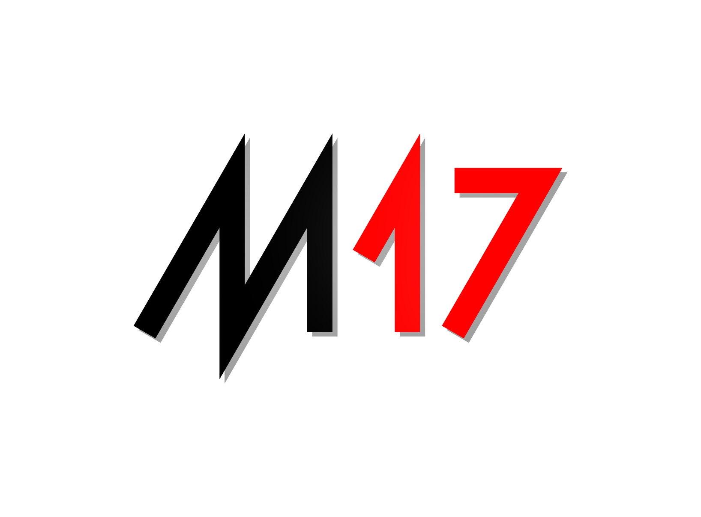

<h1 align="center">
  <br>
  <a href="https://m17project.org"></a>
  <br>
  M17-Discord-Bot
  <br>
</h1>

<h4 align="center">A bot written for the M17 Discord server written in <a href="https://www.python.org/" target="_blank">Python</a>.</h4>

<p align="center">
  <a href="https://discord.gg/G8zGphypf6">
    
  </a>
  <a href="https://github.com/kc1awv/m17-discord-bot/issues">
    
  </a>
  <a href="https://github.com/kc1awv/m17-discord-bot/pulls">
      
  </a>
  <a href="https://github.com/kc1awv/m17-discord-bot/blob/main/LICENSE">
    
  </a>
</p>

<p align="center">
  <a href="#key-features">Key Features</a> •
  <a href="#how-to-use">How To Use</a> •
  <a href="#download">Download</a> •
  <a href="#credits">Credits</a> •
  <a href="#roadmap">Roadmap</a> •
  <a href="#contributing">Contributing</a> •
  <a href="#license">License</a>
</p>

<!--  -->

## Key Features

* `ping` - ping the bot to find latency between you and it
* `ref conn [reflector] [module]` - connect to an M17 Reflector and module to listen
* `ref disc` - disconnect from the Reflector being listened to

## How To Use

### Requirements

* Python 3.9+
* pip

To clone and run this application, you'll need [Git](https://git-scm.com), [Python](https://www.python.org/), and [pip](https://pypi.org/project/pip/) installed on your computer. 

From your command line:

```bash
# Clone this repository
$ git clone https://github.com/kc1awv/m17-discord-bot

# Go into the repository
$ cd m17-discord-bot

# Install dependencies
$ python -m pip install -r requirements.txt

# Copy and configure .env file
$ cp .env.sample .env

# Run the app
$ python bot.py
```

> **Note**
> It is suggested that you run this program in a Python virtual environment.
> Creating a Python venv is out of scope of this project, but information about
> doing so can be found across the Internet.

## Download

There are no official releases of the bot code at this time. Cloning the repo 
and running the program as described above is the most effective way of 
operating the bot.

## Credits

This software uses the following open source packages:

- [Python](https://python.org)
- [pyM17](https://pypi.org/project/m17/)
- [pycord](https://github.com/Pycord-Development/pycord)

## Roadmap

- [ ] Better voice channel handling
- [ ] Additional M17 features

## Contributing

Contributions are what make the open source community such an amazing place to learn, inspire, and create. Any contributions you make are **greatly appreciated**.

If you have a suggestion that would make this better, please fork the repo and create a pull request. You can also simply open an issue with the tag "enhancement".
Don't forget to give the project a star! Thanks again!

1. Fork the Project
2. Create your Feature Branch (`git checkout -b feature/AmazingFeature`)
3. Commit your Changes (`git commit -m 'Add some AmazingFeature'`)
4. Push to the Branch (`git push origin feature/AmazingFeature`)
5. Open a Pull Request

## License

AGPL

---
